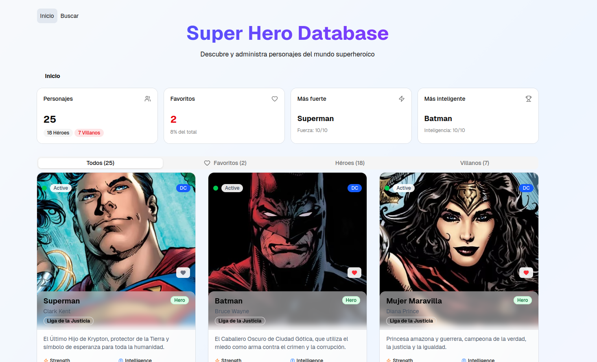
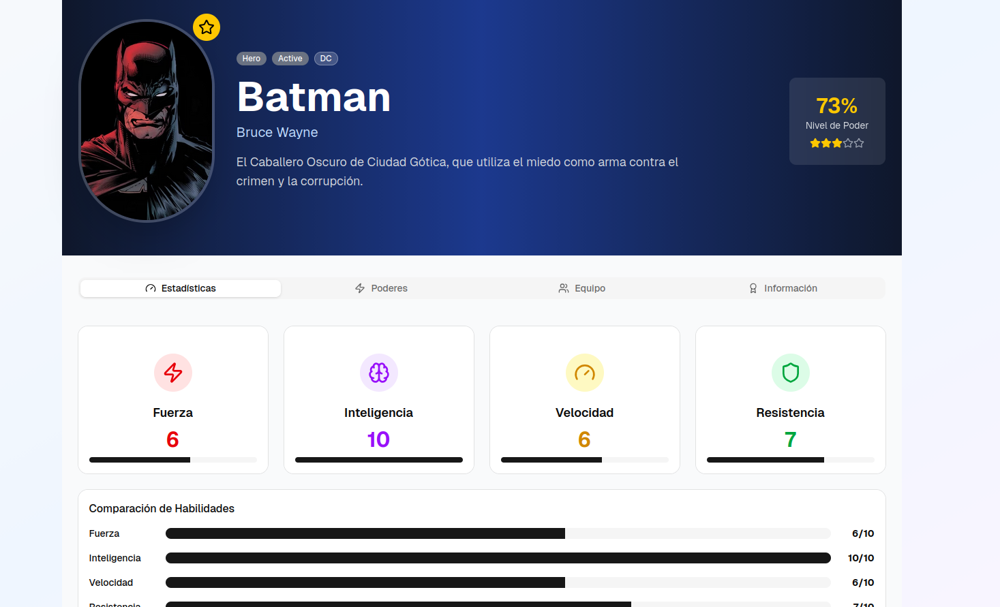
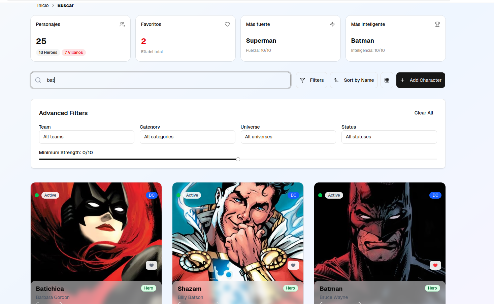
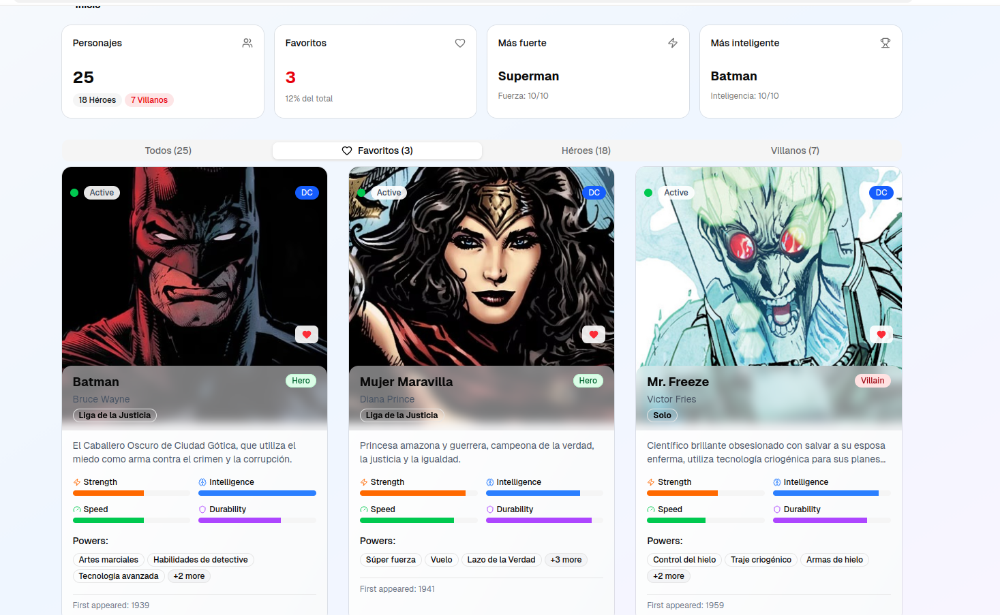

# Heroes App — Frontend 🦸

A superhero management app built with React 19 and a modern fullstack architecture. Browse heroes and villains with paginated listings, view detailed stats, perform advanced searches, and manage entries through an admin panel — all powered by a NestJS REST API.

🌐 **Live Demo:** [heroes-app.netlify.app](https://TU-URL-DE-NETLIFY.netlify.app/)
🔗 **Backend repo:** [heroes-app-backend](https://github.com/lgabriel97/heroes-app-backend)

---

## Screenshots

| Home | Hero Detail | Search | Favourites |
| --- | --- | --- | --- |
|  |  |  |  |

---

## Features

- **Paginated hero listing** with category filtering (Heroes / Villains / All)
- **Hero detail view** with stats (strength, intelligence, speed, durability), powers, team, and universe info
- **Advanced search** with multiple filters: name/alias, team, category, universe, status, and minimum strength
- **Lazy-loaded search page** for optimized initial bundle size
- **Admin panel** for hero management (CRUD)
- **Dashboard summary** showing total heroes, strongest, smartest, and hero/villain counts
- **Responsive UI** built with shadcn/ui + Radix UI primitives

---

## Tech Stack

| Layer | Technology |
| --- | --- |
| Framework | [React 19](https://react.dev/) with [React Compiler](https://react.dev/learn/react-compiler) |
| Language | [TypeScript 6](https://www.typescriptlang.org/) |
| Build Tool | [Vite 8](https://vite.dev/) |
| Styling | [Tailwind CSS 4](https://tailwindcss.com/) + [tw-animate-css](https://github.com/Wombosvideo/tw-animate-css) |
| UI Components | [Radix UI](https://www.radix-ui.com/) + [shadcn/ui](https://ui.shadcn.com/) |
| Icons | [Lucide React](https://lucide.dev/) |
| Routing | [React Router 7](https://reactrouter.com/) (Hash Router) |
| Server State | [TanStack React Query 5](https://tanstack.com/query) |
| HTTP Client | [Axios](https://axios-http.com/) |
| Hosting | [Netlify](https://www.netlify.com/) |

---

## Getting Started

### Prerequisites

- Node.js >= 18
- npm >= 9
- The [backend service](https://github.com/lgabriel97/heroes-app-backend) running (locally or deployed)

### Installation

```bash
git clone https://github.com/lgabriel97/heroes-app-frontend.git
cd heroes-app-frontend
npm install
```

### Environment variables

```bash
cp .env.template .env
```

Edit `.env` with the backend URL:

```
VITE_API_URL=http://localhost:3000
```

### Run in development

```bash
npm run dev
```

The app will be available at `http://localhost:5173`.

### Build for production

```bash
npm run build
npm run preview   # Preview the production build locally
```

---

## Project Structure

```
src/
├── admin/
│   ├── layouts/
│   │   └── AdminLayout.tsx           # Admin section layout
│   └── pages/
│       └── AdminPage.tsx             # Hero management (CRUD)
├── assets/                           # Static images and icons
├── components/
│   ├── custom/                       # App-specific shared components
│   └── ui/                           # shadcn/ui components (Button, Card, etc.)
├── heroes/
│   ├── actions/                      # Server actions / mutations
│   ├── api/
│   │   └── heroes.api.ts             # Axios instance (base URL config)
│   ├── components/                   # Hero cards, stat bars, etc.
│   ├── context/                      # React context providers
│   ├── hooks/                        # Custom hooks (useHeroes, useHero, etc.)
│   ├── layouts/
│   │   └── HeroesLayout.tsx          # Public section layout
│   ├── pages/
│   │   ├── home/HomePage.tsx         # Paginated hero listing + dashboard
│   │   ├── hero/HeroPage.tsx         # Hero detail (by ID or slug)
│   │   └── search/SearchPage.tsx     # Advanced search (lazy loaded)
│   └── types/                        # TypeScript interfaces (Hero, Pagination, etc.)
├── lib/
│   └── utils.ts                      # Utility functions (cn, etc.)
├── router/
│   └── app.router.tsx                # Hash-based routing config
├── index.css                         # Global styles + Tailwind
├── main.tsx                          # App entry point
└── HeroesApp.tsx                     # Root component (QueryClient + Router)
```

---

## Deployment

The frontend is deployed on **Netlify** with automatic deploys on push to `main`.

**Environment variable required in Netlify:**

| Variable | Value |
| --- | --- |
| `VITE_API_URL` | `https://heroes-app-backend-y9rd.onrender.com` |

> **Note:** The backend runs on Render's free tier, so the first request after inactivity may take ~30 seconds while the service wakes up.

---

## Related

- [heroes-app-backend](https://github.com/lgabriel97/heroes-app-backend) — NestJS 11 REST API that powers this app

---

## License

This project is unlicensed — feel free to use it as reference.